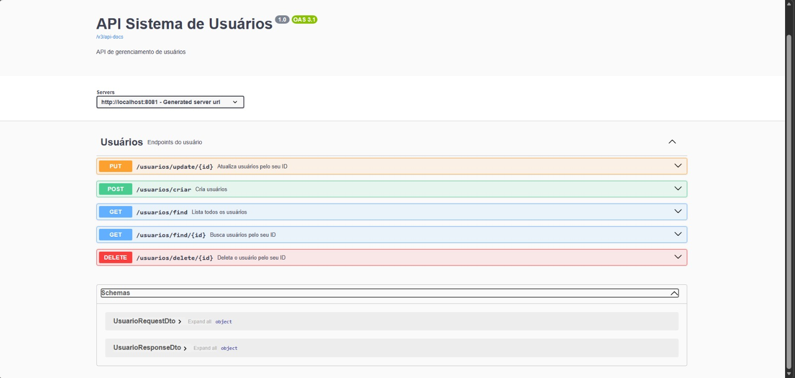
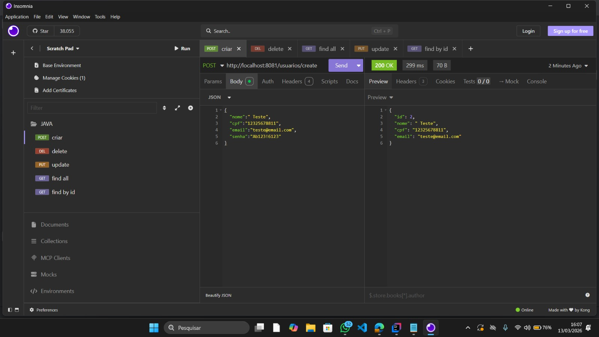

# 🏦 Sistema de Gestão de Usuários - API REST

Este projeto é uma API robusta para gerenciamento de usuários, desenvolvida durante o **Bootcamp Deloitte**. A aplicação foca em práticas de código limpo, segurança de dados e alta cobertura de testes.

## 🚀 Tecnologias
* **Java 21** (Linguagem principal)
* **Spring Boot 3.4.3** (Framework)
* **Spring Data JPA** (Persistência de dados)
* **H2 Database** (Banco de dados em memória para testes e desenvolvimento)
* **Spring Security Crypto** (Criptografia de senhas com BCrypt)
* **MapStruct** (Mapeamento performático entre Entidades e DTOs)
* **Lombok** (Produtividade no código)
* **Bean Validation** (Regras de negócio e validações de input)
* **JUnit 5 & Mockito** (Testes unitários com 100% de cobertura de métodos)

---

## 🏗️ Estrutura do Projeto

Para garantir a escalabilidade e a manutenção do código, o projeto foi dividido em camadas:

* **Controller:** Porta de entrada da API, onde as rotas são expostas e documentadas via Swagger.
* **Service:** Camada de regra de negócio. Aqui reside a lógica de hash de senha e validações de dados duplicados.
* **DTO (Data Transfer Object):** Utilizado para trafegar dados com segurança, evitando expor a entidade do banco de dados diretamente e também não deixando usuário colocar campos vazios.
* **Mapper (MapStruct):** Realiza a conversão automática entre Entidade e DTO, mantendo o código limpo.
* **Validation:** Classes customizadas para garantir que Email e CPF's  não sejam duplicados.
* **Exception Handler:** Centraliza o tratamento de erros, retornando mensagens claras para o cliente da API.

---

## 🔒 Segurança e Regras de Negócio
- **Criptografia:** As senhas dos usuários são transformadas em hashes utilizando BCrypt antes de chegarem ao banco de dados.
- **Validação de Dados:** - CPF e Email únicos (validação via camada de Service e Exception Handler( personalização de respostas de erro) ).
    - Senhas com exigência de caracteres especiais, letras e números via Regex.
- **Tratamento de Exceções:** Implementação de um `GlobalExceptionHandler` para retornos HTTP padronizados.

---

## 🛠️ Destaques Técnicos

* `DadosDuplicadosException`: Exceção personalizada capturada pelo Handler para evitar CPFs/Emails repetidos.
* `SecurityConfig`: Configuração do `BCryptPasswordEncoder` para garantir a segurança das senhas e elas serem salvas em Hash pelo Banco H2.

---
## 📖 Documentação Interativa (Swagger UI)

A API está totalmente documentada via **Swagger (OpenAPI)**. Após rodar a aplicação, acesse a interface interativa:

- **Swagger UI:** `http://localhost:8081/swagger-ui.html`
  Visualize e teste os endpoints diretamente do seu navegador.
  

---

## 🛣️ Endpoints da API

| Método | Endpoint                | Descrição |
| :----- |:------------------------| :-------- |
| **POST** | `/usuarios/create`      | Registra um novo usuário (Gera Hash de senha) |
| **GET** | `/usuarios/find/{id}`   | Busca os detalhes de um usuário específico |
| **GET** | `/usuarios/find`        | Lista todos os usuários cadastrados |
| **PUT** | `/usuarios/update/{id}` | Atualiza dados (com validação de duplicidade) |
| **DELETE** | `/usuarios/delete/{id}` | Remove um usuário permanentemente |

 Teste da APi com Insomnia

---

## 🧪 Qualidade de Código e Testes

O projeto foi desenvolvido seguindo os princípios **SOLID**. A camada de serviço possui cobertura total de testes, garantindo que fluxos de erro (como e-mails duplicados) e fluxos de sucesso funcionem conforme o esperado.

### 🗄️ Acesso ao Banco de Dados (H2 Console)

A API utiliza um banco de dados em memória para facilitar o desenvolvimento. Você pode visualizar as tabelas e os dados inseridos acessando:
- **URL:** `http://localhost:8081/h2-console`

---

**Credenciais de Acesso:**

| **JDBC URL** | `jdbc:h2:mem:banco` |
| **User Name** | `user` |
| **Password** | `admin` |

---
Desenvolvido por **Arthur Leão**
